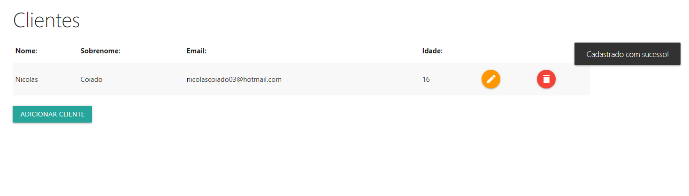
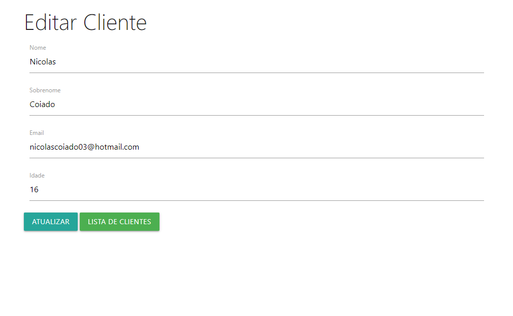
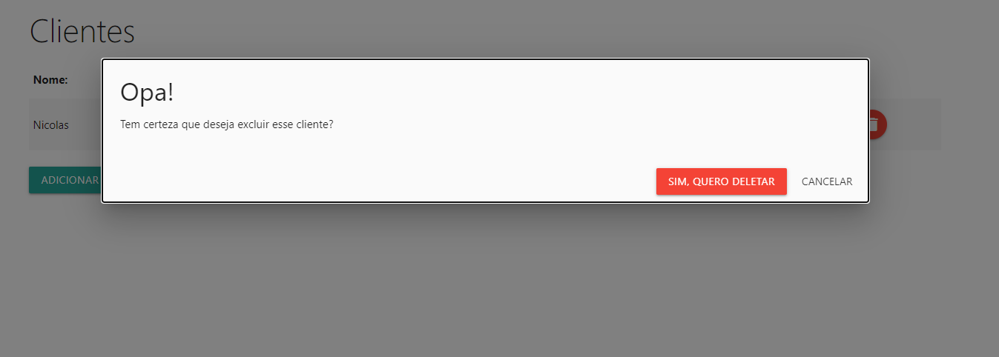

# PHP-CRUD
Um projeto que criei para realizar um exercício da minha matéria de programação para WEB da Etec da Zona Leste, e tive como base o curso de PHP do site [NodeStudio](https://www.nodestudio.com.br).

---

# Utilidade
O projeto cadastra clientes, também é possível consultá-los, os editar e excluí-los.

---

# O framework 
O framework utilizado foi o [Materialize](https://materializecss.com) e caso queira ter acesso a ele, basta clicar no seu nome!

---

# O site:

